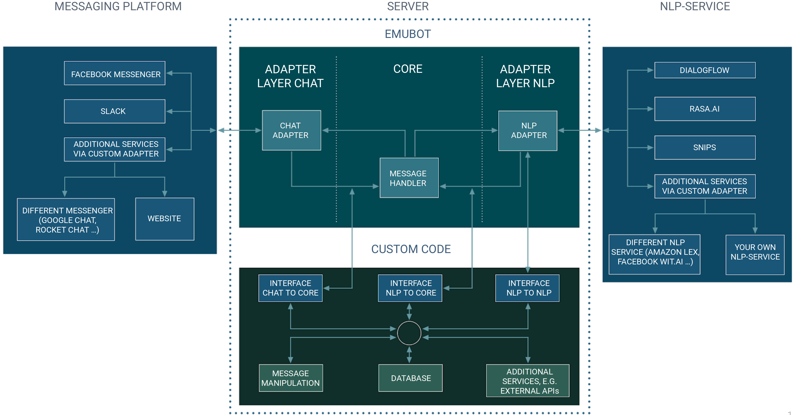

.. _interceptors:

Interceptors
============================
The general structure of our architecture can be seen here:

There are three distinctive interfaces that allow you to interact with the framework. We call these interfaces the "Chat to Core",
"Nlp to Nlp" and "Nlp to Core" interceptor and explain possible use of each interface below. If you do not wish to perform any actions, you can simply
use a :code:`MirrorInterface` which is already part of our base framework and is used in our exemplar repositories. At the interceptor you can
perform any action (like adding or removing data from the incoming query), as long as you  return the same format, wrapped in a :code:`Response`.
Using the :code:`Response` wrapper, you can...

1. determine if a message handling should be continued normally or if the processing should be interrupted.

2. handle message types not supported by our framework by interrupting the usual process (set the `interruptProcessing` flag inside a :code:`Response`
   to true). It is expected that the message then already includes all relevant information to answer a user, or

3. interrupt the processing by sending a :code:`NoResponse`. The user will not receive any notification. This might be confusing and you should manually
   send a message from your interceptor.

We will now further investigate the three interceptors and common usages.

.. _chatTocore:

Chat to Core
------------

After the user query has been stripped of unnecessary data, we directly pass the data to the Chat to Core interface. The interface expects to receive a
:code:`ChatAdapterRequest` and returns a :code:`Response<ChatAdapterRequest>`. At this interceptor, we commonly

1. Manipulate the message itself, e.g. change the content or type of a message, transform a speech message to a text message or pseudonymize the user identifier.
2. Update the state of other applications (e.g. reposting contexts to your NLP service provider or saving/retrieving information to/from some database).
3. Handle unknown incoming message types and either transform them into a text message, return a message with a type supported by our framework, or handle the
   message directly and interrupt the default framework message handling procedure.

.. _pseudonymization:

Pseudonymize the User
~~~~~~~~~~~~~~~~~~~~~

One important feature is the protection of the user identity. Several common messengers transmit a user identifier which can be used to retrieve some additional
and sensitive information like the name or profile data on social media. This information should be protected from any entity that does not require the data (and
should, at least in europe, be treated according to the GDPR). An easy way is to exchange the user ID from the messenger with some pseudonym that is mapped back
to the identifier as soon as you want to send the message back to the user.

An exemplar implementation can be found in our `extended example <https://github.com/emundo/emubot-extended-example/>`_.

.. _nlpTonlp:

Nlp to Nlp
-----------
This second interceptor is especially of relevance if you utilize multiple agents. In the section about :ref:`custom_chat_adapter`, we explain the default workflow.
This means, that a message is passed to another agent if it doesnt exceed a minimal score or if a fallback intent occurs.

Using the Nlp to Nlp interface, you can further introduce advanced rules set by yourself:
Sometimes you want to return some fallback intent, ignore the minimal score or delete contexts set by an agent whose message you do not want to send to the user.

:code:`nlpToCore` expects an incoming :code:`NlpResponse` and returns a :code:`Response<NlpResponse>`.

.. _nlpTocore:

Nlp to Core
-----------

After determining the intent (and possibly receiving a static response), you can perform actions using the Nlp to Core interface. Once again, this can have different
purposes:

You might want to
1. manipulate the message (e.g. use parameters retrieved from the NLU platform for a database request, used to assemble a new answer),
2. begin some event (e.g. send message to the client in5x minutes),
3. save/retrieve data to/from a service (e.g. save contexts in a database), or
4. map the pseudonymized user ID to the user ID from the messenger for further processing.

:code:`nlpToCore` expects an incoming :code:`NlpResponse` and returns a :code:`Response<NlpResponse>`.
